### Sin autenticación

1. Página de inicio y navegación principal:

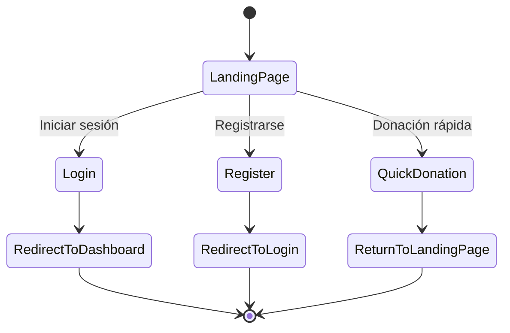

2. Proceso de registro:

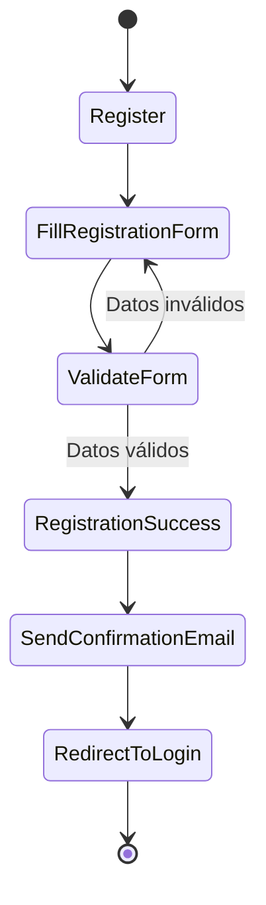

3. Donación rápida:

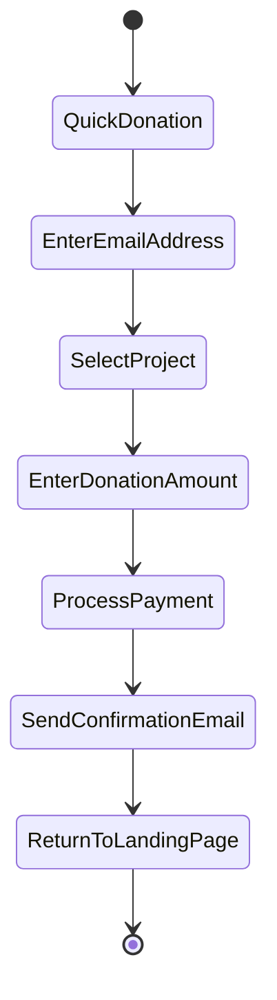

### Usuario

1. Proceso de login de usuario:

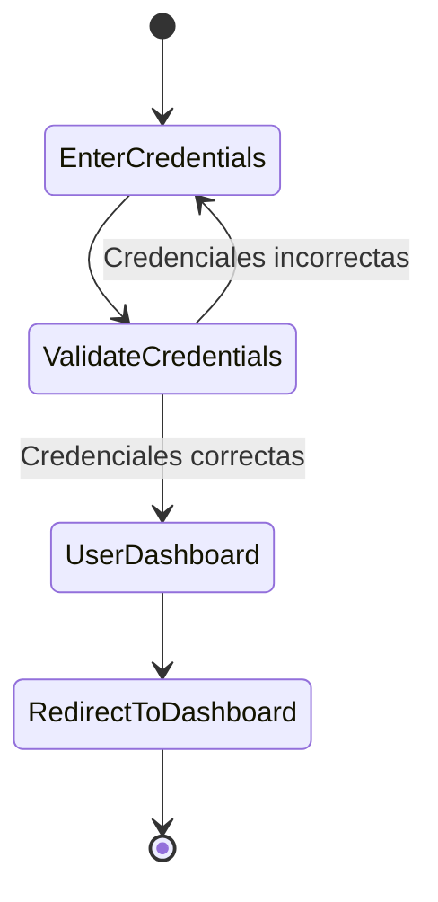

2. Dashboard de usuario:

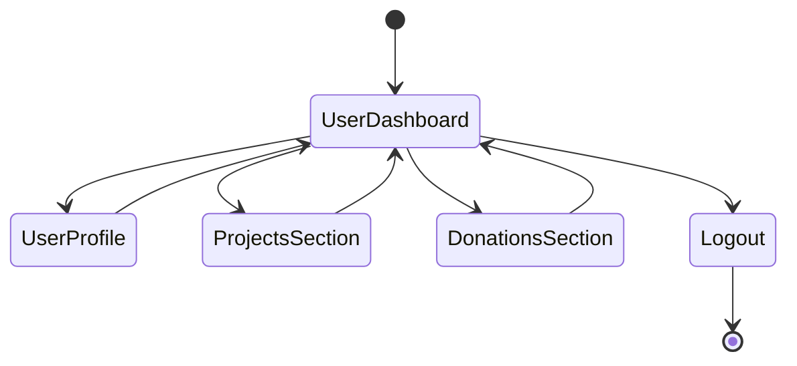

3. Gestión de perfil de usuario:

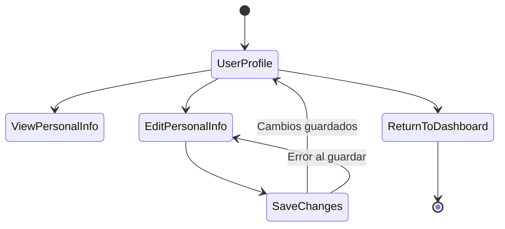

4. Sección de proyectos:

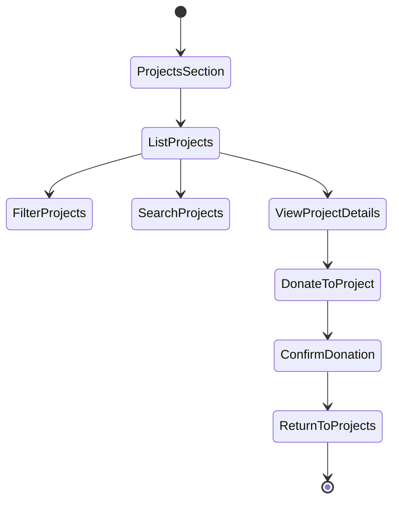

5. Sección de donaciones:

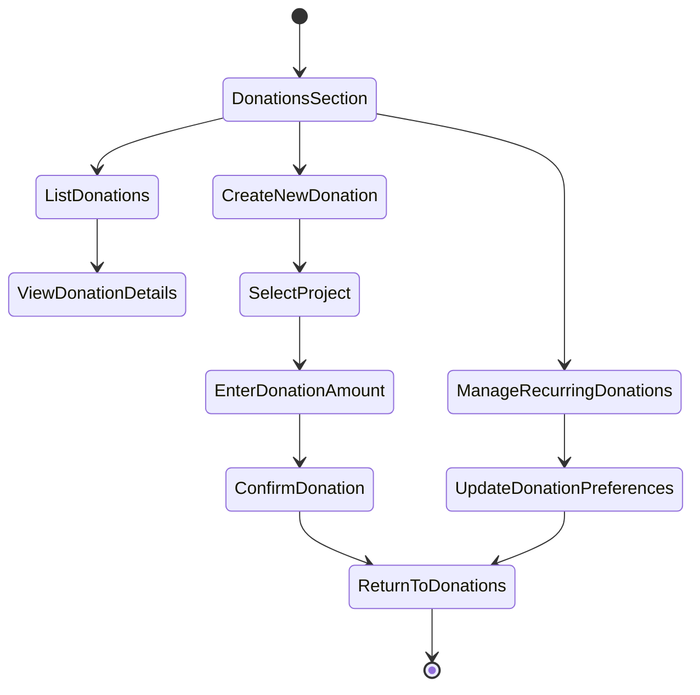

### Administrador

1. Proceso de login de administrador:

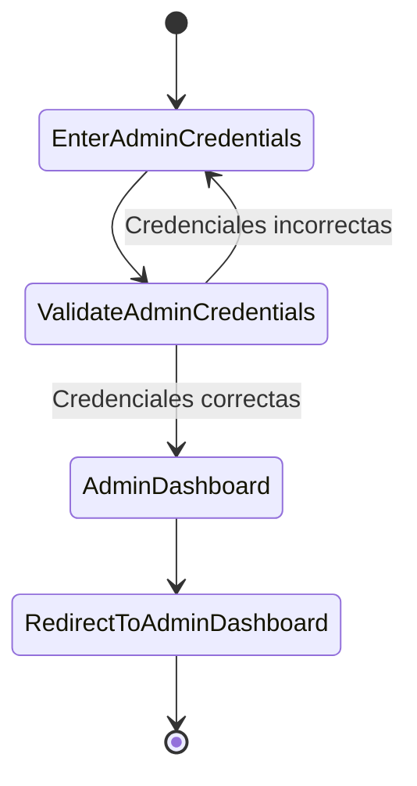

2. Dashboard de administrador:

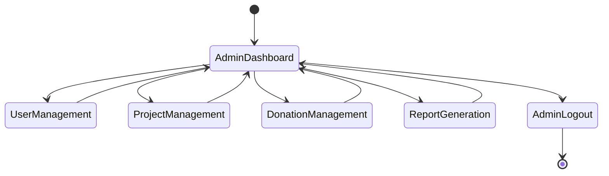

3. Gestión de usuarios:

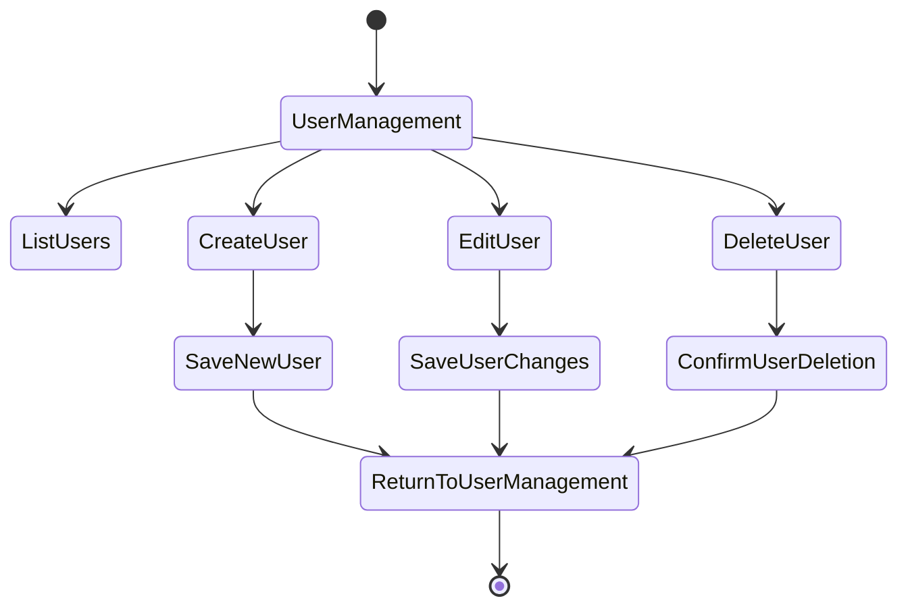

4. Gestión de proyectos:

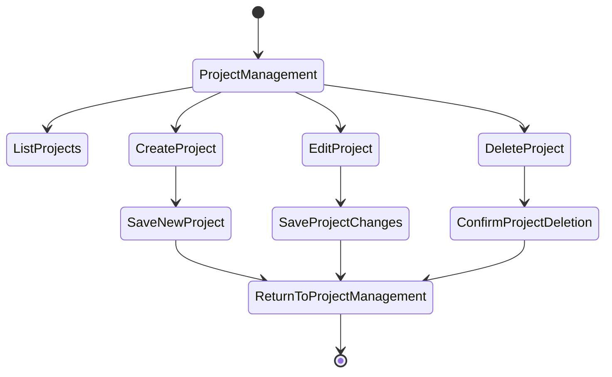

5. Gestión de donaciones:

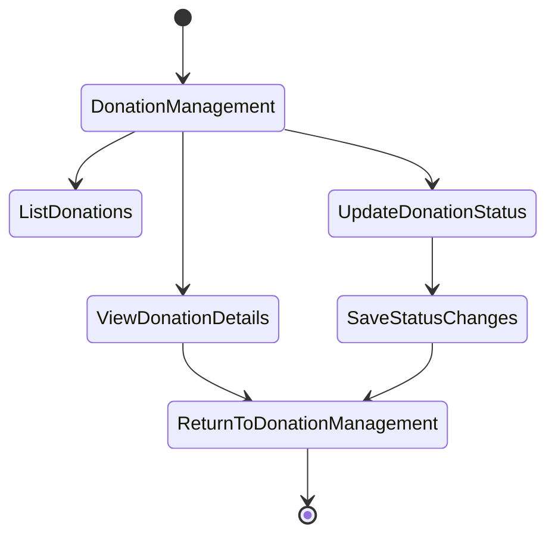

6. Generación de reportes:

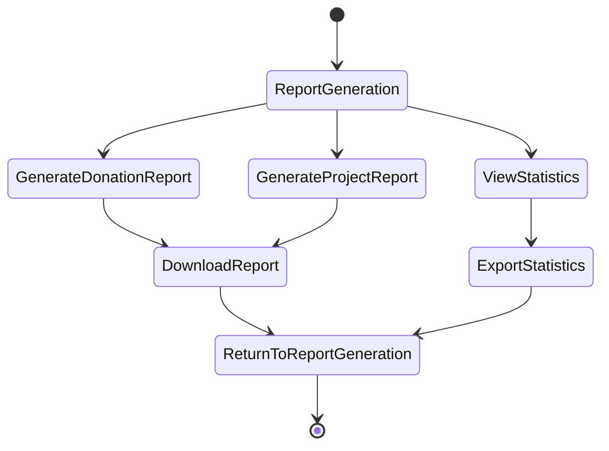
