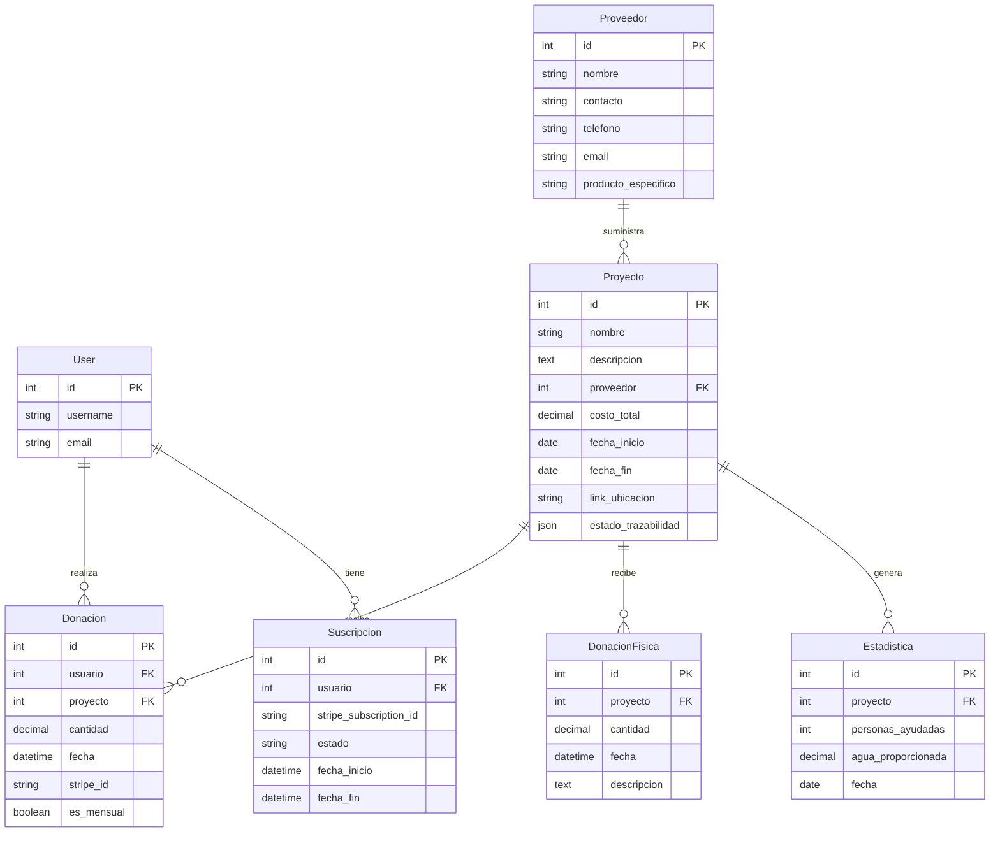

# Sistema de Donaciones

## Descripción

Este sistema de donaciones permite gestionar proyectos, proveedores, y donaciones tanto físicas como en línea. Está diseñado para administradores y donantes, con interfaces separadas para cada tipo de usuario.

## Tecnologías Utilizadas

- Frontend: React con React Admin
  - Plantilla: [Minimal Dashboard Pro](https://mui.com/store/items/minimal-dashboard/) - Una plantilla de panel de administración premium basada en Material-UI
- Backend: Node.js con Express
- Base de Datos: PostgreSQL con Prisma ORM (librería)
- Autenticación: JWT y Google OAuth
- Pagos: Stripe
- Logging y Monitoreo: Grafana

## Estructura de la Base de Datos

## Características Principales

### Para Administradores

1. Dashboard con métricas de donaciones, proyectos y proveedores
2. Gestión de Usuarios (cambio de roles)
3. Gestión de Proveedores (CRUD)
4. Gestión de Proyectos (CRUD)
   - Incluye geolocalización y carga de imágenes
   - Toggle para requerimiento de proveedor
5. Gestión de Donaciones (online y físicas)
6. Reportes y Estadísticas

### Para Donantes

1. Exploración de Proyectos
2. Sistema de Donación (única y recurrente)
3. Perfil de Usuario
4. Historial de Donaciones

## Vistas

### Vistas de Administrador

1. Login
2. Dashboard
3. Gestión de Usuarios
4. Gestión de Proveedores
5. Gestión de Proyectos
6. Gestión de Donaciones Online
7. Gestión de Donaciones Físicas
8. Reportes

### Vistas de Donante

1. Login (con Google)
2. Exploración de Proyectos
3. Detalles del Proyecto
4. Formulario de Donación
5. Perfil de Usuario
6. Historial de Donaciones

### Vistas de Correo Electrónico

1. Confirmación de Donación
2. Asignación de Donación a Proyecto
3. Finalización de Proyecto
4. Agradecimiento por Donación Recurrente
5. Resumen de Impacto

## Autenticación

- JWT para sesiones de usuario
- Integración con Google OAuth para login de donantes
- Middleware de autenticación para proteger rutas

## Integración de Pagos

- Stripe para procesar pagos de donaciones
- Soporte para donaciones únicas y recurrentes

## Características Adicionales

- Geolocalización para proyectos
- Carga y gestión de imágenes para proyectos
- Sistema de trazabilidad de estado para proyectos
- Cálculo automático de estadísticas

## Seguridad

- Implementación de RBAC (Control de Acceso Basado en Roles)
- Middleware para manejo de CORS, rate limiting, y headers de seguridad
- Validación de datos de entrada

## Optimización

- Caching con Redis
- Lazy loading de componentes React
- Optimización de consultas a la base de datos

## Logs

El sistema utiliza Grafana para el monitoreo y visualización de logs. Esto permite un seguimiento eficiente del rendimiento de la aplicación, la actividad de los usuarios y facilita la detección temprana de problemas.

## Testing

- Pruebas unitarias con Jest
- Pruebas de integración
- Pruebas E2E con Cypress

## Cómo Empezar

1. Clonar el repositorio
2. Instalar dependencias: `npm install`
3. Configurar variables de entorno
4. Iniciar el servidor de desarrollo: `yarn run dev`

## Contribución

[Instrucciones para contribuir al proyecto]

## Licencia

[Tipo de licencia]
